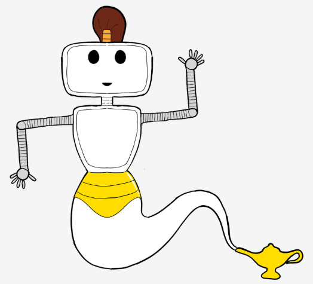

  

# AIGenie

Our AI host for the AI Lab at Oslo Met receives YOU, answers  YOUR questions and informs YOU about the AI Lab.

## Getting started

To access the Backend you have to follow the instructions of: [Backend ReadMe](./Backend/README.md).

To access the Frontend you have to follow the instructions of: [Frontend ReadMe](./Frontend/README.md).

Happy Coding🌻
